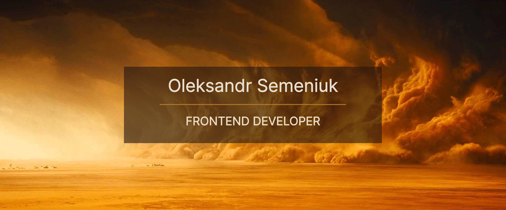

 
<h1 align="center">Hi there! 👋 I'm Alex, a Web Developer.</h1>

I'm passionate about creating beautiful, functional and user-friendly websites that help businesses and individuals achieve their goals. With my skills in web development, I strive to build websites that are not only visually appealing, but also perform well and meet the needs of their users.

 
<h2 align="center">Languages and Tools which i use:</h2>

   

    
    
   <a href="https://www.typescriptlang.org/" target="_blank" rel="noreferrer">  
    
    
    
    
    
     
    
         
       
    
    
    

 
 

   

    
    
   

 
